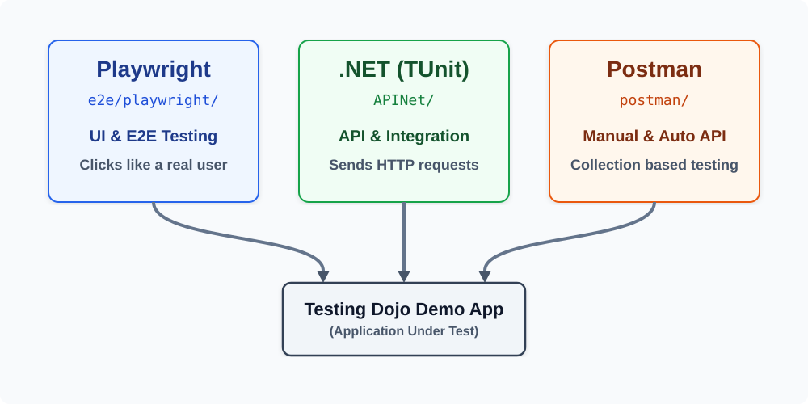

# Testing Dojo

[](https://github.com/apis3445/TestingDojo/actions/workflows/tests.yml)
[](https://github.com/apis3445/TestingDojo/actions/workflows/claude-code-review.yml)

A multi-stack test automation project covering UI and API testing against the [Testing Dojo demo app](https://abi-testing-dojo-demo.azurewebsites.net/).

---

## How testing is organized

This repo contains three independent testing projects, each targeting the same application from a different angle:



| Project                              | Language         | What it tests                                       |
| ------------------------------------ | ---------------- | --------------------------------------------------- |
| [`e2e/playwright/`](e2e/playwright/) | TypeScript       | UI (browser) — verifies what a user sees and clicks |
| [`APINet/`](APINet/)                 | C# (.NET 10)     | REST API — verifies the server's responses directly |
| [`postman/`](postman/)               | Postman / Newman | REST API — requests, test scripts, and data-driven runs via CSV |

Each project has its own README with detailed setup and architecture notes:

- [Playwright README](e2e/playwright/README.md)
- [.NET API README](APINet/README.md)
- [Postman README](postman/README.md)

---

## Best Practices

These two rules apply to every project in this repo. They are the most important things to understand before writing or running any test.

### Best Practice 1 — Never store credentials in code

Usernames and passwords must **never** appear in `.ts`, `.cs`, or `.json` files that are committed to git. If they are, anyone with access to the repository can read them — including in old commits even after they are "deleted".

Each project stores credentials in a different safe location:

| Project    | Where credentials live locally                                                                | How CI receives them                                      |
| ---------- | --------------------------------------------------------------------------------------------- | --------------------------------------------------------- |
| Playwright | `.env` file inside `e2e/playwright/` — excluded from git by `.gitignore`                      | GitHub Actions Secrets, injected as environment variables |
| .NET       | `dotnet user-secrets` — stored in your OS user profile, completely outside the project folder | GitHub Actions Secrets, injected as environment variables |
| Postman    | `--env-var` flags passed on the command line — never saved to a file                          | GitHub Actions Secrets, injected as `--env-var` flags     |

Tests read credentials at runtime using environment variables or configuration — the actual values are never in the source code:

```typescript
// Playwright — reads from .env locally or from CI environment at runtime
await loginPage.login({
  UserName: process.env.ADMIN_USER,
  Password: process.env.ADMIN_PASSWORD,
});
```

```csharp
// .NET — reads from user secrets locally or from CI environment at runtime
Company  = Configuration["USER_ADMIN_COMPANY"],
Password = Configuration["USER_ADMIN_PASSWORD"],
```

### Best Practice 2 — Store UI text in JSON locale files, not in code

The app supports multiple languages (English, Spanish, German, Japanese). UI tests locate elements by their **visible text** — for example, the label on the Login button. If that text is hardcoded in English, tests will fail when a different language is active.

The solution: every UI string lives in a JSON file per language inside `e2e/playwright/data/`.

```
e2e/playwright/data/
  en-US.json   ← English
  es-MX.json   ← Spanish
  de-DE.json   ← German
  ja-JP.json   ← Japanese
```

Each file has the same structure — only the values differ:

```jsonc
// en-US.json
{ "home": { "login": "Login", "user": "User", "pass": "Password" } }

// es-MX.json
{ "home": { "login": "Iniciar Sesión", "user": "Usuario", "pass": "Contraseña" } }
```

In code, always reference the key — never the raw string:

```typescript
// Good — uses the translated label for whichever locale is active
submit = new Button(this.page, this.localeInfo.home.login);

// Bad — hardcoded English; will break when running Spanish or German tests
submit = new Button(this.page, "Login");
```

The framework automatically loads the correct file based on the active Playwright project (language).

---

## Prerequisites

- **Node.js** (LTS) — required for Playwright and Newman
- **.NET 10 SDK** — required for the C# API tests
- **Newman** — installed as part of the Postman quick-start steps below

---

## Quick start

### Playwright

```bash
cd e2e/playwright
npm ci
npx playwright install --with-deps
# Create a .env file with your credentials — see e2e/playwright/README.md for the template
npx playwright test
```

### .NET API tests

> TUnit uses Microsoft.Testing.Platform and compiles to an executable, so tests are run via `dotnet run` (not `dotnet test`).

```bash
# Store credentials once on your machine (never committed to git)
dotnet user-secrets set "USER_ADMIN_COMPANY"  "YourCompany"      --project APINet
dotnet user-secrets set "USER_ADMIN_USERNAME" "admin@example.com" --project APINet
dotnet user-secrets set "USER_ADMIN_PASSWORD" "secret"           --project APINet

# Run all tests
dotnet run --project APINet/APINet.csproj

# Run a single test by name
dotnet run --project APINet/APINet.csproj -- --filter "Login_WithInvalidUser_ReturnsError"
```

### Postman (Newman)

```bash
npm install -g newman newman-reporter-junitfull
newman run postman/TestingDojo.postman_collection.json \
  --environment postman/TestingDojoDemo.postman_environment.json \
  --env-var "companyAdmin=YourCompany" \
  --env-var "userNameAdmin=admin@example.com" \
  --env-var "passwordAdmin=secret"
```

> The collection requires additional variables (user IDs, emails, company keys, language, etc.). See [postman/README.md](postman/README.md) for the full list.

---

## CI/CD

GitHub Actions runs all three projects on every push and pull request to `main` or `master`. See [`.github/workflows/`](.github/workflows/).

### Required GitHub secrets and variables

Go to **Settings → Secrets and variables → Actions** and add:

| Name                | Type     | Used by              | Description                                                         |
| ------------------- | -------- | -------------------- | ------------------------------------------------------------------- |
| `BASE_URL`          | Variable | Playwright                | App base URL (not sensitive — visible in logs)                      |
| `AUTH_URL`          | Variable | Playwright, Postman       | Authentication/token endpoint URL (not sensitive — visible in logs) |
| `COMPANY`           | Variable | Playwright, .NET, Postman | Company identifier for login (not sensitive)                        |
| `ADMIN_USER`        | Secret   | Playwright, .NET, Postman | Admin username (encrypted, masked in logs)                          |
| `ADMIN_PASSWORD`    | Secret   | Playwright, .NET, Postman | Admin password (encrypted, masked in logs)                          |
| `NORMAL_USER`       | Secret   | Playwright, .NET, Postman | Normal user username (encrypted, masked in logs)                    |
| `NORMAL_PASSWORD`   | Secret   | Playwright, .NET, Postman | Normal user password (encrypted, masked in logs)                    |
| `LANGUAGE`          | Variable | Postman              | Language/locale code passed to the Newman run                       |
| `USER_ID_ADMIN`     | Variable | Postman              | Admin user ID                                                       |
| `NAME_ADMIN`        | Variable | Postman              | Admin display name                                                  |
| `EMAIL_ADMIN`       | Variable | Postman              | Admin email address                                                 |
| `COMPANY_KEY_ADMIN` | Variable | Postman              | Company key for the admin account                                   |
| `USER_ID`           | Variable | Postman              | Normal user ID                                                      |
| `NAME`              | Variable | Postman              | Normal user display name                                            |
| `EMAIL`             | Variable | Postman              | Normal user email address                                           |
| `COMPANY_KEY`       | Variable | Postman              | Company key for the normal user account                             |
| `CLAUDE_CODE_OAUTH_TOKEN` | Secret | Claude Code workflows | OAuth token from `claude setup-token` — required by `claude.yml` and `claude-code-review.yml` |

Use **Variables** for non-sensitive values like URLs. Use **Secrets** for anything that must not appear in logs.

> The .NET tests read their base and auth URLs from `APINet/appsettings.json`, so they don't need `BASE_URL` or `AUTH_URL` as GitHub variables — only the credential values above.

---

## Claude Code integration

Two workflows wire [Claude Code](https://claude.ai/code) into this repo, both authenticating via `CLAUDE_CODE_OAUTH_TOKEN` (generated with `claude setup-token`, works on Pro and Max plans):

| Workflow                                                          | Trigger                                                      | What it does                                                                             |
| ------------------------------------------------------------------ | ------------------------------------------------------------- | ------------------------------------------------------------------------------------------ |
| [`claude.yml`](.github/workflows/claude.yml)                       | `@claude` mentioned in a PR/issue comment or review, or an issue opened/assigned with `@claude` in the title/body — always requires OWNER/MEMBER/COLLABORATOR authorship | Interactive assistant — implements whatever the tagging comment asks |
| [`claude-code-review.yml`](.github/workflows/claude-code-review.yml) | Every PR opened, updated, or reopened from a branch on this repo (forked PRs are skipped) | Automatic review via the `code-review` plugin — no tag needed |

> If a PR modifies either workflow file itself, GitHub blocks the app token exchange until the change is merged to the default branch (a generic GitHub Actions security restriction, not a Claude-specific issue). This self-resolves once the PR lands on `main`.

---

## Repository structure

```
.github/workflows/   CI pipeline definitions
e2e/playwright/      Playwright UI tests (TypeScript)
  api/               API request classes used in setup (e.g. LoginApi)
  data/              JSON locale files — one per supported language
  fixtures/          Custom Playwright fixtures
  pages/             Page Object classes — one per screen
  components/        Reusable UI element wrappers (Button, InputText, etc.)
  tests/             Test specifications
  utils/             Shared utilities (ApiHelper, AnnotationType)
APINet/              .NET API tests (C# + TUnit)
  RestSharp/         Tests using the RestSharp HTTP library
  RestAssured/       Same tests using the RestAssured.Net library (for comparison)
  Models/            Request/response data models
postman/             Postman / Newman API tests
  TestingDojo.postman_collection.json        All requests, folders, and test scripts
  TestingDojoDemo.postman_environment.json   Environment template — sensitive values are empty, injected at runtime
  README.md                                  Full setup, variables reference, and data-driven testing guide
```

The collection is organised into folders that mirror the API surface:

```
Login/
  Admin/    Admin login — asserts token is returned
  User/     Normal user login — asserts token is returned
            Invalid credentials — asserts 401
Menu/
  Admin/    Admin menu request — asserts admin-only items
  User/     User menu request — asserts user-level items
            Unauthenticated request — asserts 401
            Authenticated request — asserts menu is returned
```

Each folder runs in sequence. The `Login` folders capture the access token and store it in a collection variable so subsequent `Menu` requests can use it automatically — no manual copy-paste required.

test