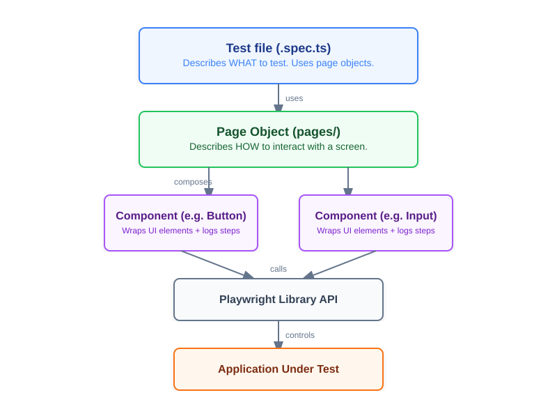
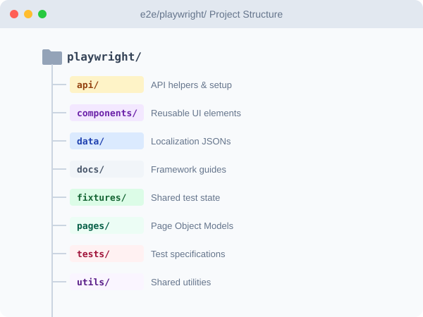
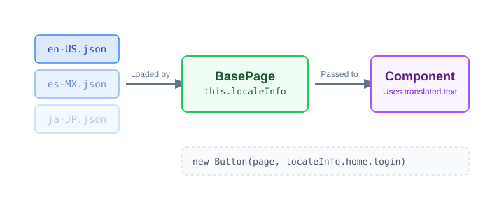

# Playwright Testing Framework

The framework is built using a modern **Page Object Model (POM)** pattern enhanced with **Atomic Components**. This architecture ensures high reusability, maintainability, and clean test code.

---

## Architecture overview

Every test follows the same layered structure. Each layer has a single responsibility:



---

## Folder structure



---

## Best Practices & Patterns

### 1. Atomic Components

Instead of writing locators directly inside page objects or tests, every interactive element is its own **Component** class.

- Each component extends `BaseComponent` and handles its own element locating and HTML-report step logging.
- **Role-based locators**: components default to `getByRole` (e.g. `getByRole('button', { name: 'Login' })`). This finds elements the same way assistive technologies do — more resilient than CSS selectors.

### 2. Localization (i18n) — why JSON files instead of hardcoded strings

The app runs in English, Spanish, German, and Japanese. Tests locate elements by their **visible text labels** (e.g. the "Login" button). If a test hardcodes `'Login'`, it breaks the moment the Spanish locale is active (`'Iniciar Sesión'`).

**The solution:** store every UI string in a JSON file per language and reference it by key in code.



`BasePage` loads the correct file at construction time based on the active locale. The locale comes from the Playwright **project name** (defined in `playwright.config.ts`), so running the `Spanish` project automatically uses `es-MX.json`.

```typescript
// Good — locale-aware, works in every language
submit = new Button(this.page, this.localeInfo.home.login);

// Bad — hardcoded English, breaks in other locales
submit = new Button(this.page, 'Login');
```

**To add a new language:**
1. Create `data/xx-XX.json` with the same keys as `en-US.json`.
2. Import it in `pages/BasePage.ts` and add it to the `locales` map.
3. Add a `fixtures/index.ts` entry mapping the project name to the locale code.
4. Add a project in `playwright.config.ts`.

### 3. Reporting & Steps

Every action — click, fill, navigation, assertion — is wrapped in `test.step()` directly inside the component or page object method. This produces a readable timeline in the Playwright HTML report without any extra abstraction layer.

`AnnotationType` contains only three values (`Precondition`, `PostCondition`, `Description`) and is only used in spec annotation arrays — never inside page objects or components.

```
Open the report after any run:
npx playwright show-report
```

### 4. Base Classes

- **`BasePage`** — provides `localeInfo` (translated strings), `goTo()`, `navigateTo()`, and access to the shared `Menu` component. All page objects extend this.
- **`BaseComponent`** — provides the `locator`. All component wrappers extend this. Each component method wraps its action in `test.step()` for automatic report logging.

### 5. API Setup / Teardown

The `api/` layer is used when a test needs data to exist before it starts (a **precondition**). Calling the API directly is much faster than creating data through the UI, and it keeps tests focused on what they are actually verifying.

Example: instead of clicking through a form to create a user before testing the login page, call the API endpoint directly and let the test start with the user already in place.

All HTTP calls go through `utils/ApiHelper`, which handles creating the `APIRequestContext`, attaching the Bearer token, and exposing `get`, `post`, `put`, and `delete` methods. API classes in `api/` instantiate `ApiHelper` with the relevant base URL and delegate to it.

### 6. Security — credentials never in code

Credentials are read from environment variables at runtime — never stored in source files.

- **Local:** create `e2e/playwright/.env` with your values (this file is in `.gitignore`).
- **CI:** GitHub Actions injects them as environment variables from repository Secrets.

```typescript
// Credentials are injected at runtime — the source file contains no real values
await loginPage.login({
  UserName: process.env.ADMIN_USER,
  Password: process.env.ADMIN_PASSWORD,
});
```
