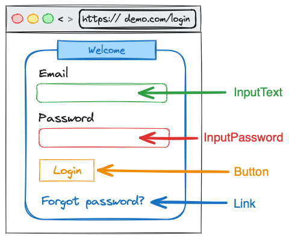
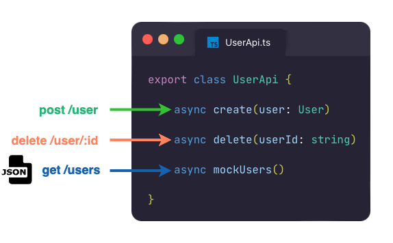
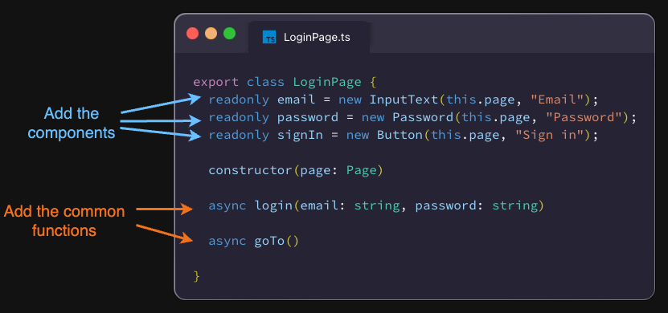
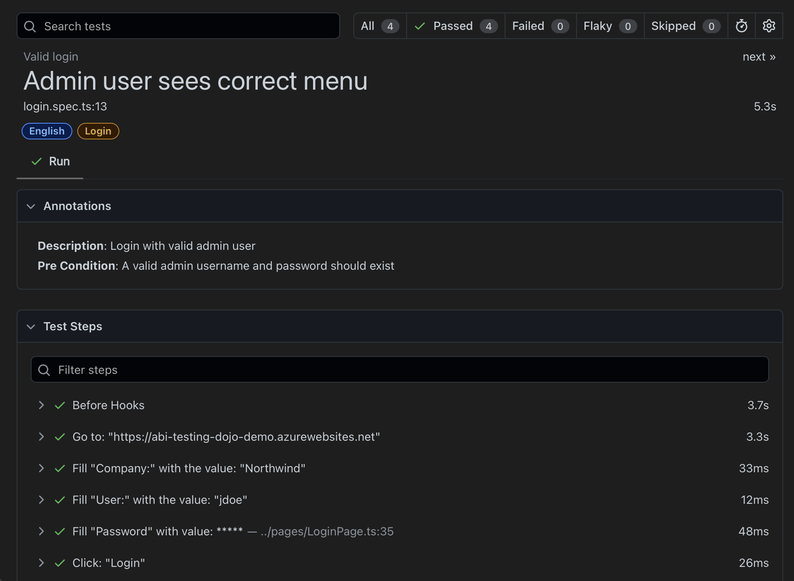

# How to Create a Test

This guide explains how to create a new test using the current framework structure and best practices.

## 1. Locate Elements

Before writing code, identify the elements you need to interact with.



- **Pick locator in VS Code**: Use the Playwright extension's "Pick Locator" feature to find accessible roles and names.
- **Playwright Codegen**: Run the following command to record your actions and generate locators:
  ```bash
  npx playwright codegen https://abi-testing-dojo-demo.azurewebsites.net/
  ```
- **Chrome Extensions**: You can also use tools like [LetXPath](https://www.youtube.com/watch?v=Oz13qjh1aqE) or [SelectorsHub](https://www.youtube.com/watch?v=Iqp0qh3Up44) to identify locators.

Refer to [Playwright best practices for locators](https://playwright.dev/docs/best-practices#use-locators).

## 2. Localization (i18n) & Text Locators

A best practice in Playwright is to select elements by their **visible text** (using `getByRole`, `getByText`, or `getByLabel`). This ensures tests behave like a real user and are more accessible.

Since the application supports multiple languages, we do not hardcode strings. Instead, we use **JSON files** for each language.

### Localization JSON Example (`data/en-US.json`)

```json
{
  "home": {
    "user": "User",
    "pass": "Password",
    "login": "Login"
  }
}
```

### Using Locale Info in Code

Each page inherits `localeInfo` from `BasePage`. You should use these properties when defining components:

```typescript
// Good: Uses the translated text from JSON
company = new InputText(this.page, this.localeInfo.home.company);

// Bad: Hardcoded text (will fail if the language changes)
company = new InputText(this.page, "Company");
```

## 3. Add or Update Components

If you need a new reusable element, create a component class. Components handle their own logic and reporting so that your tests stay clean.

### Understanding the Reporting Code:

- **`stepDescription`**: This is the human-readable text that will appear in the final Playwright HTML report. It explains _what_ the automation is doing (e.g., "Fill Password: **\*\***").

**Example: `InputPassword.ts`**

```typescript
import test, { Page } from "@playwright/test";
import { InputText } from "./InputText";

export class InputPassword extends InputText {
  constructor(page: Page, selector: string, byRole = true) {
    super(page, selector, byRole);
  }

  override async fill(value: string) {
    const stepDescription = `Fill "${this.locator.description()}" with value: *****`;
    await test.step(stepDescription, async () => {
      await this.locator.fill(value);
    });
  }
}
```

## 4. Create an API Class (Optional)

Some pages use APIs to insert, update, delete, or retrieve data. If your test needs specific data before it starts (a **pre-condition**), using an API is much faster and more reliable than doing it through the user interface.



### How to identify APIs:

- **Network Tab**: Open your browser's Developer Tools (F12), go to the **Network** tab, and perform an action on the page. You will see the requests being made.
- **Documentation**: Ask developers for **Swagger** documentation or **Postman** collections to understand the available endpoints and required data.

**Example: `LoginApi.ts`**

```typescript
export class LoginApi {
  constructor(private readonly page: Page) {}

  async login(userLogin: Login): Promise<string> {
    const apiHelper = new ApiHelper(this.page, process.env.AUTH_URL!);
    const response = await apiHelper.post("/api/users/login", userLogin);
    if (!response.ok())
      throw new Error(
        `Login API failed [${response.status()}]: ${await response.text()}`,
      );
    const data = (await response.json()) as LoginResponse;
    if (!data.AccessToken) throw new Error("Login API returned no AccessToken");
    return data.AccessToken;
  }
}
```

## 5. Create the Page Object Model (POM)

The Page Object Model (POM) is a design pattern that creates a class for each page. Think of it as a **map** of the screen: it contains all the buttons, inputs, and common actions (like logging in) that you can perform on that specific page.

### Why use POM?

- **Reusability**: If the "Login" button changes its name, you only have to update it in _one_ place (the LoginPage class) instead of in every single test.
- **Organization**: It keeps the test files clean and focused on the "business scenario" rather than the technical locators.



Define your page class by extending `BasePage`. Use the `localeInfo` property for all text labels.

**Example: `LoginPage.ts`**

```typescript
export class LoginPage extends BasePage {
  company = new InputText(this.page, this.localeInfo.home.company);
  user = new InputText(this.page, this.localeInfo.home.user);
  password = new InputPassword(this.page, this.localeInfo.home.pass);
  submit = new Button(this.page, this.localeInfo.home.login);

  async login(userLogin: UserLogin) {
    await this.goTo();
    await this.company.fill(userLogin.Company);
    await this.user.fill(userLogin.UserName);
    await this.password.fill(userLogin.Password);
    await this.submit.click();
  }
}
```

## 6. Create the Test

Write your test in the `tests/` folder.

### Why use a Fixture?

Instead of using the default `@playwright/test`, we import `test` from `../fixtures`. This custom fixture automatically handles:

- **Locale Management**: It injects the correct language data (`locale`) based on your configuration.
- **Shared Tools**: It provides pre-configured page objects or utilities, saving you setup time in every test.

### Security & Environment Variables

**Never store usernames or passwords directly in your code.** This is a major security risk as anyone with access to the code can see them.
Instead, we use **Environment Variables** (`process.env.VARIABLE_NAME`). This allows you to:

- **Protect Credentials**: Keep passwords out of the repository.
- **Switch Environments**: Easily run the same test against different environments (QA, Staging, Production) by just changing the variable values.

**Example: `login.spec.ts`**

```typescript
import { test } from "../fixtures";
import { LoginPage } from "../pages/LoginPage";
import { DashboardPage } from "../pages/DashboardPage";

test.describe("Login Scenarios", () => {
  test("should login with valid admin user", async ({ page, locale }) => {
    const loginPage = new LoginPage(page, locale);
    await loginPage.login({
      Company: process.env.COMPANY!,
      UserName: process.env.ADMIN_USER!,
      Password: process.env.ADMIN_PASSWORD!,
    });

    // Assertions using localization
    const dashboardPage = new DashboardPage(page, locale);
    await dashboardPage.menu.waitFor();
    const expectedMenus = dashboardPage.localeInfo.menu.admin;
    const menuInPage = await dashboardPage.menu.getMenus();
    await dashboardPage.assertArrayEqual(
      expectedMenus,
      menuInPage,
      "Menu items should match",
    );
  });
});
```

With the steps you can see the details of the execution of the tests:

